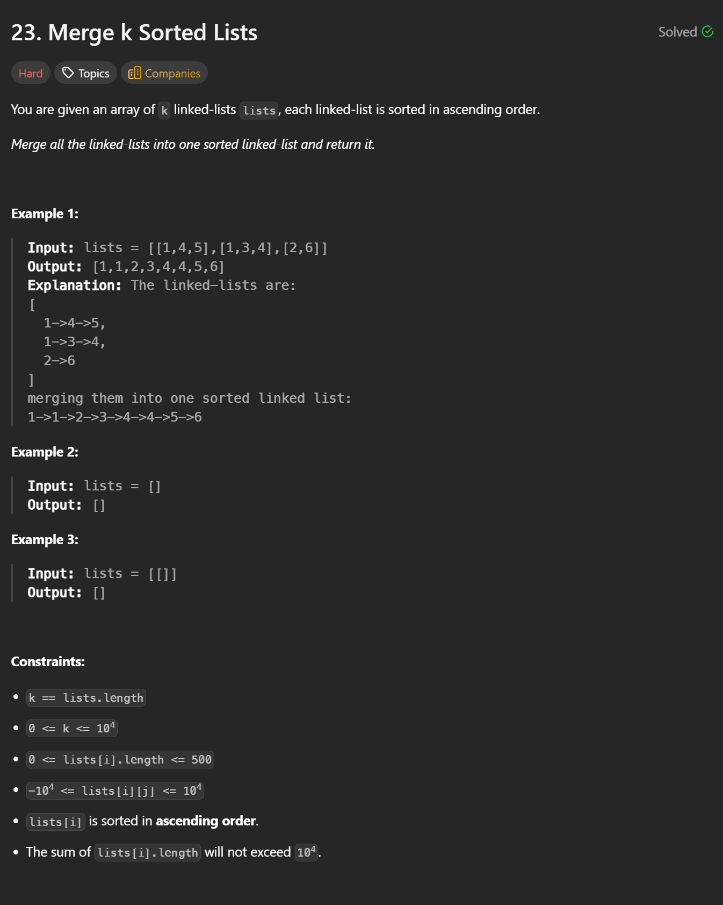

### CPP
```cpp
/**
 * Definition for singly-linked list.
 * struct ListNode {
 *     int val;
 *     ListNode *next;
 *     ListNode() : val(0), next(nullptr) {}
 *     ListNode(int x) : val(x), next(nullptr) {}
 *     ListNode(int x, ListNode *next) : val(x), next(next) {}
 * };
 */
class Solution {
public:
    ListNode* mergeKLists(vector<ListNode*>& lists) {
        if(lists.empty()) return nullptr;

        auto merge = [&](ListNode* l1, ListNode* l2) {
            ListNode dummy(0);
            ListNode* curr = &dummy;
            while(l1 && l2) {
                if(l1->val < l2->val) {
                    curr->next = l1;
                    l1 = l1->next;
                } else {
                    curr->next = l2;
                    l2 = l2->next;
                }
                curr = curr->next;
            }
            curr->next = l1 ? l1 : l2;
            return dummy.next;
        };

        function<ListNode*(int,int)> divide = [&](int left, int right) {
            if(left == right) return lists[left];
            int mid = left + (right - left) / 2;
            return merge(divide(left, mid), divide(mid + 1, right));
        };
        
        return divide(0, lists.size() - 1);
    }
};
```