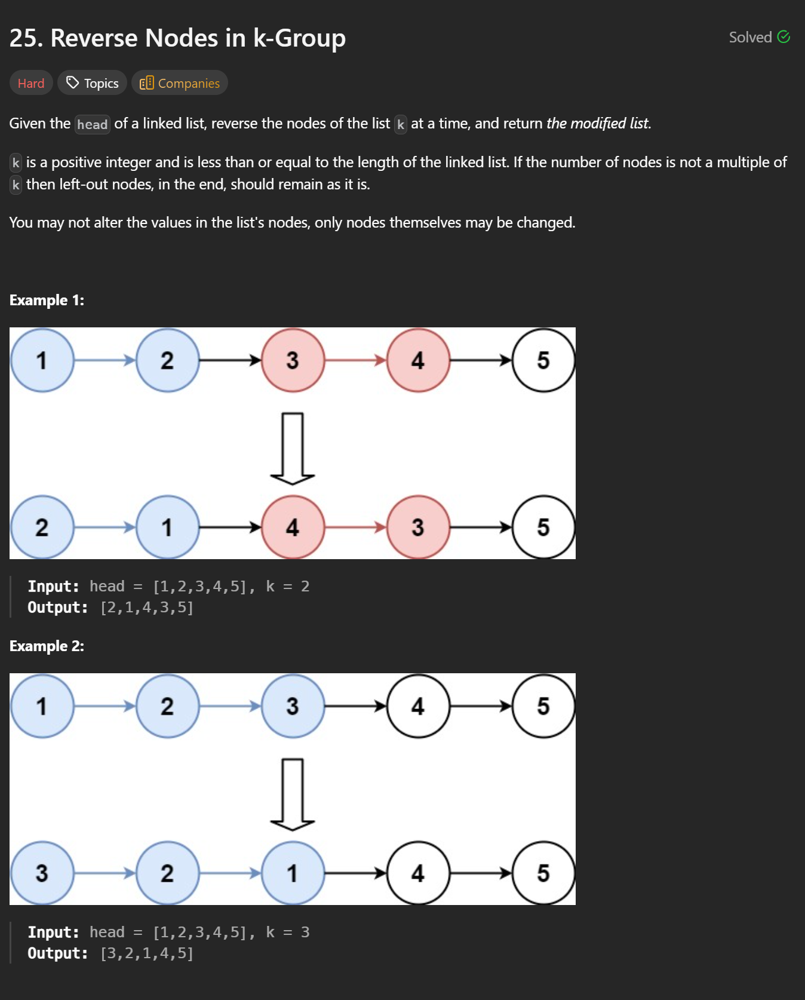
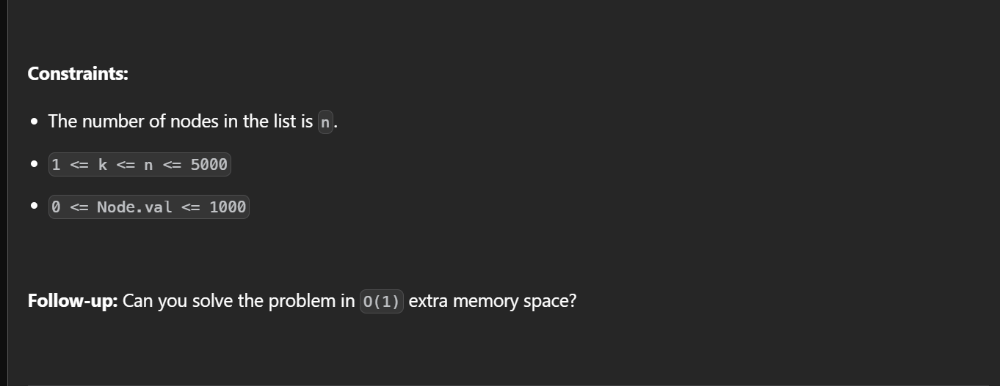

```cpp
/**
 * Definition for singly-linked list.
 * struct ListNode {
 *     int val;
 *     ListNode *next;
 *     ListNode() : val(0), next(nullptr) {}
 *     ListNode(int x) : val(x), next(nullptr) {}
 *     ListNode(int x, ListNode *next) : val(x), next(next) {}
 * };
 */
class Solution {
public:
    ListNode* reverseKGroup(ListNode* head, int k) {
        ListNode dummy(0);
        dummy.next = head;
        ListNode* prev = &dummy;
        
        while(true) {
            ListNode* curr = prev->next;
            ListNode* kth = prev;
            for(int i = 0; i < k; i++) {
                kth = kth->next;
                if(!kth) {
                    return dummy.next;
                }
            }

            ListNode* rp = nullptr;
            ListNode* rc = curr;
            for(int i = 0; i < k; i++) {
                ListNode* rn = rc->next;
                rc->next = rp;
                rp = rc;
                rc = rn;
            }

            prev->next = kth;
            curr->next = rc;
            prev = curr;
        }

    }
};
```