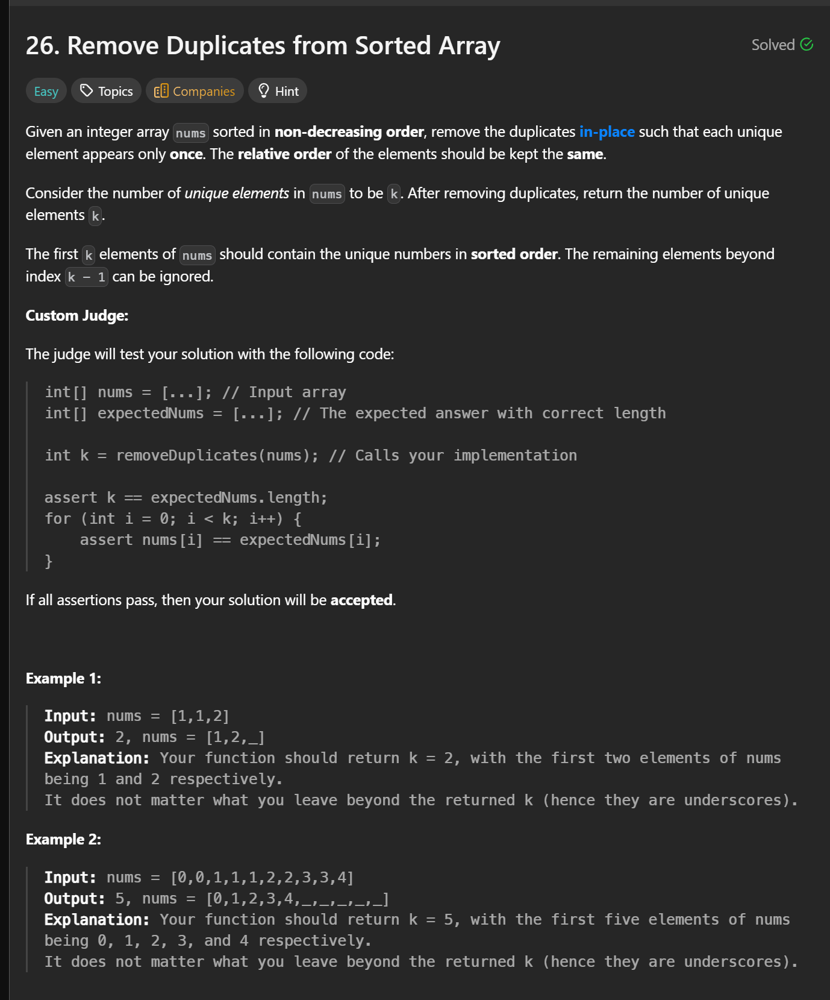
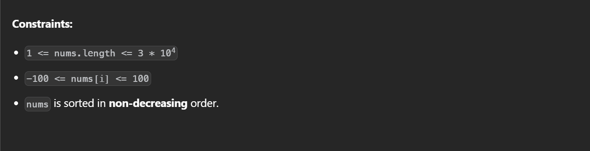

```cpp
class Solution {
public:
    int removeDuplicates(vector<int>& nums) {
        int ptr = 0;
        for(int i = 0; i < nums.size(); i++) {
            if(nums[i] != nums[ptr]) {
                ptr++;
                nums[ptr] = nums[i];
            }
        }
        return ptr + 1;
    }
};
```


TC: O(n)  
SC: O(1)  