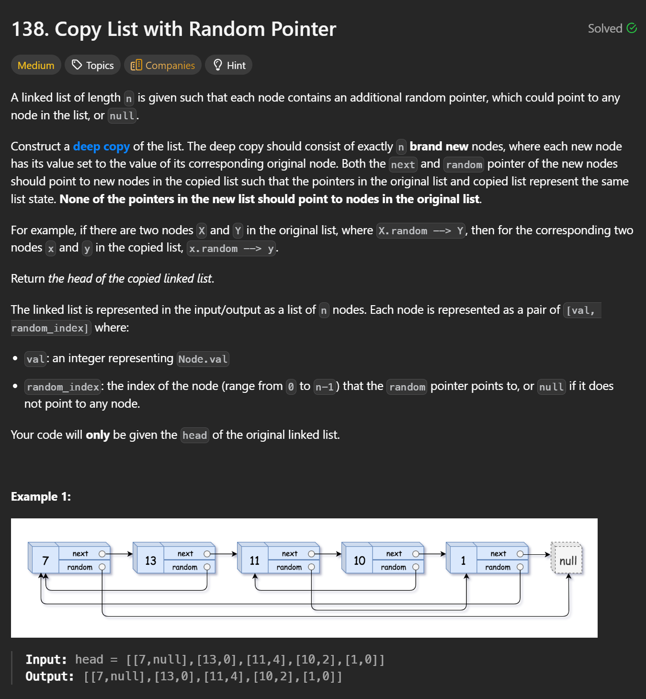
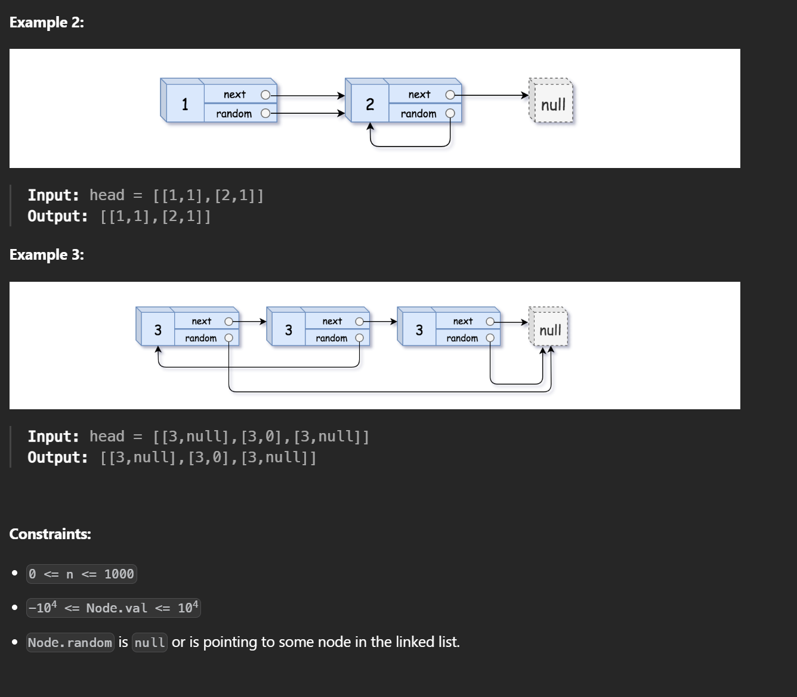

```cpp
/*
// Definition for a Node.
class Node {
public:
    int val;
    Node* next;
    Node* random;
    
    Node(int _val) {
        val = _val;
        next = NULL;
        random = NULL;
    }
};
*/

class Solution {
public:
    Node* copyRandomList(Node* head) {
        if(!head) return nullptr;
        Node* curr = head;
        while(curr) {
            Node* clone = new Node(curr->val);
            clone->next = curr->next;
            curr->next = clone;
            curr = curr->next->next;
        }

        curr = head;
        while(curr) {
            if(curr->random) {
                curr->next->random = curr->random->next;
            }
            curr = curr->next->next;
        }

        curr = head;
        Node* newHead = head->next;
        Node* newCurr = newHead;
        while(curr) {
            newCurr = curr->next;
            curr->next = curr->next->next;
            if(curr->next) {
                newCurr->next = curr->next->next;
            }
            curr = curr->next;
        }
        return newHead;
    }
};
```