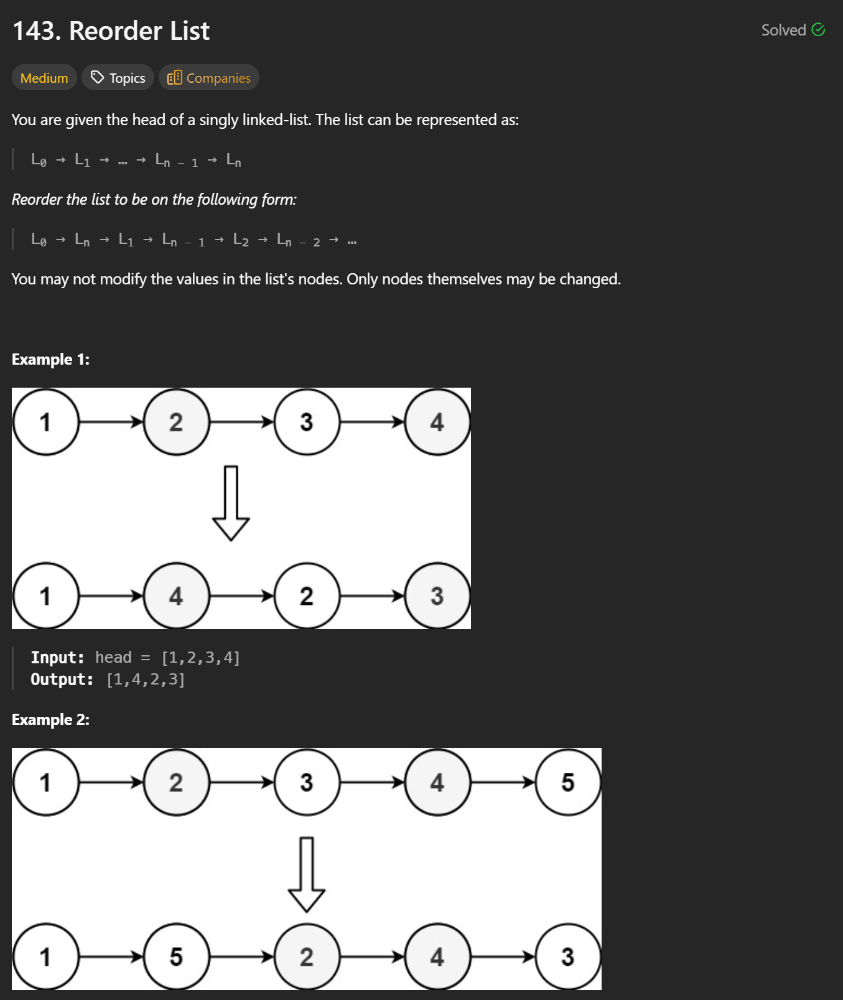
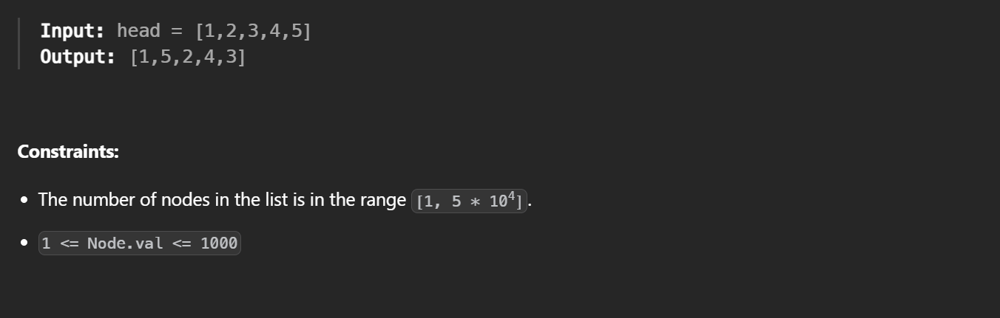

```cpp
/**
 * Definition for singly-linked list.
 * struct ListNode {
 *     int val;
 *     ListNode *next;
 *     ListNode() : val(0), next(nullptr) {}
 *     ListNode(int x) : val(x), next(nullptr) {}
 *     ListNode(int x, ListNode *next) : val(x), next(next) {}
 * };
 */
class Solution {
public:
    void reorderList(ListNode* head) {
        if (!head || !head->next) return;

        // 1) find middle
        ListNode *slow = head, *fast = head;
        while (fast->next && fast->next->next) {
            slow = slow->next;
            fast = fast->next->next;
        }

        // 2) reverse second half
        ListNode* cur = slow->next;
        slow->next = nullptr;
        ListNode* prev = nullptr;
        while (cur) {
            ListNode* nxt = cur->next;
            cur->next = prev;
            prev = cur;
            cur = nxt;
        }

        // 3) merge
        ListNode* p1 = head;
        ListNode* p2 = prev;
        while (p2) {
            ListNode* n1 = p1->next;
            ListNode* n2 = p2->next;
            p1->next = p2;
            p2->next = n1;
            p1 = n1;
            p2 = n2;
        }
    }
};

```