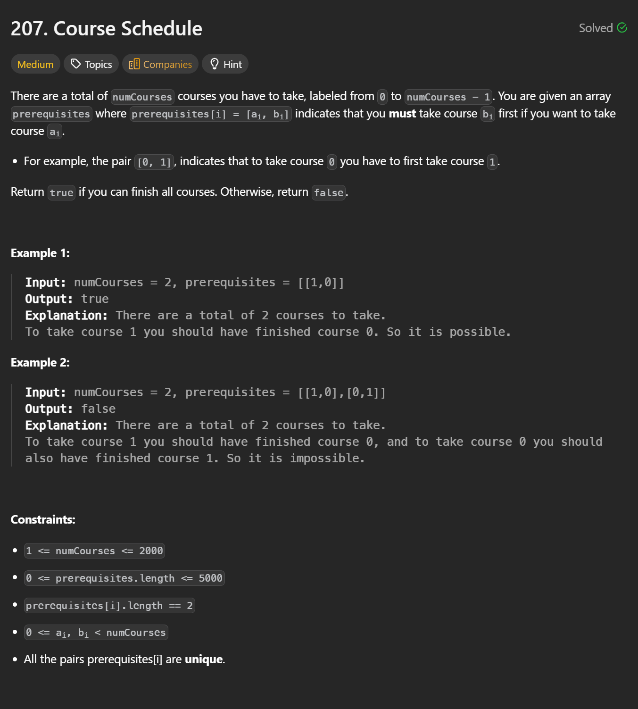

```cpp
class Solution {
public:
    bool canFinish(int numCourses, vector<vector<int>>& prerequisites) {
        vector<vector<int>> graph(numCourses);
        vector<int> indegree(numCourses, 0);

        for (const auto &p : prerequisites) {
            int v = p[0], u = p[1];   // b -> a
            graph[u].push_back(v);
            indegree[v]++;
        }

        queue<int> q;
        for (int i = 0; i < numCourses; i++) {
            if (indegree[i] == 0) q.push(i);
        }

        int taken = 0;
        while (!q.empty()) {
            int u = q.front(); q.pop();
            taken++;
            for (int v : graph[u]) {
                indegree[v]--;
                if (indegree[v] == 0) q.push(v);
            }
        }

        return taken == numCourses;
    }
};

```

## Time Complexity

**O(V + E)**

Where:
- **V** = number of nodes = `numCourses`
- **E** = number of edges = `prerequisites.length`

### Explanation

1. **Build graph & indegree**
   ```cpp
   for (prerequisite : prerequisites)
   ```
   - Processes each prerequisite once  
   - **O(E)**

2. **Initialize queue**
   ```cpp
   for (i = 0; i < V; i++)
   ```
   - Checks every node once  
   - **O(V)**

3. **BFS (Kahn’s algorithm)**
   - Each node is pushed into the queue **once**
   - Each edge is processed **once** when decrementing indegree

   - **O(V + E)**

### Total Time
```
O(E) + O(V) + O(V + E) = O(V + E)
```

---

## Space Complexity

**O(V + E)**

### Breakdown

1. **Adjacency list**
   ```cpp
   vector<vector<int>> g
   ```
   - Stores all edges  
   - **O(E)**

2. **Indegree array**
   ```cpp
   vector<int> indeg
   ```
   - One entry per node  
   - **O(V)**

3. **Queue**
   - Can hold up to all nodes in the worst case  
   - **O(V)**

### Total Space
```
O(E) + O(V) = O(V + E)
```

---

## ✅ Final Summary (Interview-Ready)

- **Time Complexity:** `O(V + E)`
- **Space Complexity:** `O(V + E)`

> Any algorithm that detects cycles in a directed graph must at least examine all vertices and edges, so this is optimal.
