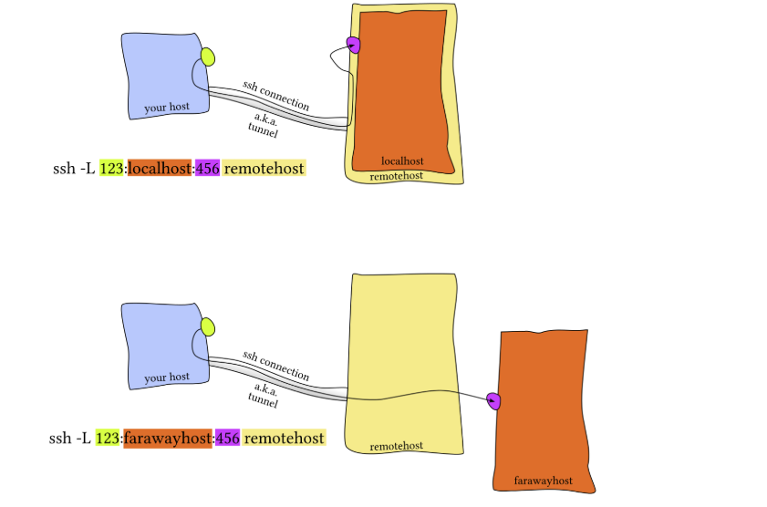
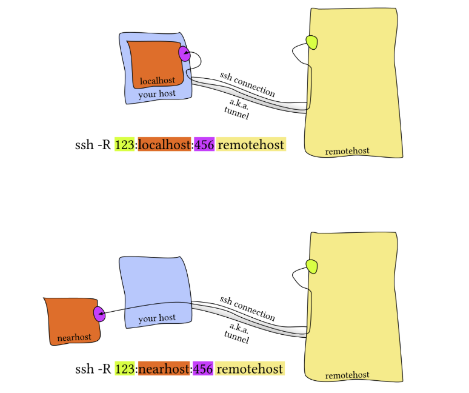

# Lecture 5: Command-line Environment  
## Job Control

### Sending signals
-  Ctrl-C: send SIGINT to the foreground process
-  Ctrl-\: send SIGQUIT to the foreground process, will send the process that couldn't end by Ctrl-C
- `kill -TERM <PID>` ： Killing a process
- `kill <PID>`: send SIGTERM to a process    Example: kill 1234
- `kill -SIGNAL <PID>`: send a specific signal to a process   Example: kill -STOP 1234
- `kill %n`: send a signal to a job by job number            Example: kill %1

### Signals (process control)
- SIGTSTP: stop a process (usually sent by Ctrl-Z)
- SIGSTOP: forcefully stop a process (cannot be caught or ignored)
- SIGINT: interrupt a process (usually sent by Ctrl-C)
- SIGTERM: politely ask a process to terminate (default kill)
- SIGHUP: hangup signal sent when terminal closes
- SIGKILL (-9): immediately terminate a process (cannot be caught or ignored)

### Pausing and backgrounding processes
-  Ctrl-Z: will prompt the shell to send a SIGTSTP signal, short for Terminal Stop
- `jobs`: list jobs associated with the current terminal session
- `%n`: refer to a job by its job number (shown by jobs)
- `fg %n`: bring job n to the foreground   Example: fg %1
- `bg %n`: continue job n in the background       Example: bg %1
- `Ctrl-Z`: deliver SIGTSTP to pause the foreground process
- `Ctrl-Z` + bg: pause a foreground process and resume it in the background
- `command &`: run a command in the background (STDOUT still attached)  Example: sleep 1000 &
- `$!`: PID of the most recently backgrounded process   Example: echo $!
- `disown`: remove a job from shell job control      Example: disown %1
- `PID`: unique identifier of a process (used by kill)
- `pgrep`: find process IDs by process name   
    1. pattern / regex matching (may have other results)  2. Match args -f 
    Example: pgrep sleep
             pgrep -af sleep: Show PID and command
             pgrep -f python

- `pidof`: find process IDs by process name   
    1. exact name matching  2. doesn't support Match args -f 
    Example: pidof nginx
             pidof sshd

### Aliases
- Format:  alias alias_name="command_to_alias arg1 arg2"
- aliases do not persist shell sessions by default. To make an alias persistent you need to include it in shell startup files, like .bashrc or .zshrc
- `alias ll="ls -lh"`: declare one alias ll and the meaning of this comment is same as ls -lh # Make shorthands for common flags
- `alias ll`: Will print ll='ls -lh'
- `alias lla="ll -l"`:  Alias can be composed. ll -> lla
- `unalias ll`: disable an alias altogether with unalias

### Common Dotfiles
- bash: ~/.bashrc, ~/.bash_profile
- git: ~/.gitconfig
- vim: ~/.vimrc, ~/.vim/
- ssh: ~/.ssh/config
- tmux: ~/.tmux.conf

### Portability - If statement
- if [[ "$(hostname)" == "myServer" ]]; then {do_something}; fi 
- if [ -f ~/.aliases ]; then
    source ~/.aliases
  fi

### Remote Machines
- `ssh foo@bar.mit.edu`:  use remote servers 
    foo = user  
    bar.mit.edu = server. It could also be an IP (something like foobar@192.168.1.42)
- `ssh foobar@server ls`: execute ls in the home folder of foobar
- `ssh foobar@server ls | grep PATTERN`: will run ls at the remote server, then the output from remote server will send to the local server and complete the grep process
- `ls | ssh foobar@server grep PATTERN`: will run the ls at the local server first, then send the output to the remote server. The remote server will conduct the grep process. After it completed, it will send the result to the local server. 
- `ssh foobar@server "ls | grep PATTERN"`: completely run all the process at the remote server

### SSH Keys
uses public/private keys to login without a password.
- `ssh-keygen -a 100 -t ed25519 -f ~/.ssh/id_ed25519`: generate a key pair
    -t ed25519: key type
    -a 100: KDF rounds for passphrase strengthening
    Use a passphrase for extra security
    Optional: ssh-agent or gpg-agent to avoid typing passphrase every time
- `ssh-keygen -y -f /path/to/key`: Check passphrase or public key
- `cat ~/.ssh/id_ed25519.pub | ssh foobar@remote 'cat >> ~/.ssh/authorized_keys'`: Copy public key to remote server
   or `ssh-copy-id -i ~/.ssh/id_ed25519 foobar@remote`
- `ssh + tee`: File transfer methods (Small one-off files)
   e.g. `cat localfile | ssh remote_server tee serverfile` : Sends local file to remote via SSH and writes it there 
- `scp`: Secure Copy (Medium files/directories)
   e.g. `scp path/to/local_file remote_host:path/to/remote_file` : Recursively copy files/directories with `-r`  
- `rsync`: (Large files, repeated sync, or interrupted transfers)
   e.g. `rsync [options] local_file remote_host:remote_file` : Detects identical files to avoid redundant copying.Supports symlinks, permissions, partial/continued transfers (`--partial`)  

### SSH Configuration
- we might use ~/.ssh/config to store the configuration of the ssh. The below is the sample of the file.
        Host vm
            User foobar
            HostName 172.16.174.141
            Port 2222
            IdentityFile ~/.ssh/id_ed25519
            LocalForward 9999 localhost:8888

        # Configs can also take wildcards
        Host *.mit.edu
            User foobaz

### Port Forwarding
- local port forwarding
  ssh -L 123:localhost:456 remotehost
  

- Remote Port Forwarding
  ssh -R 123:localhost:456 remotehost
  

For example, if we execute jupyter notebook in a remote server that listens to the port 8888. Thus, to forward that to the local port 9999, we would do `ssh -L 9999:localhost:8888 foobar@remote_server` and then navigate to localhost:9999 in our local machine.

### Shells & Frameworks
-  zsh shell is a superset of bash and provides many convenient features out of the box such as:
    - Smarter globbing, **
    - Inline globbing/wildcard expansion
    - Spelling correction
    - Better tab completion/selection
    - Path expansion (cd /u/lo/b will expand as /usr/local/bin)